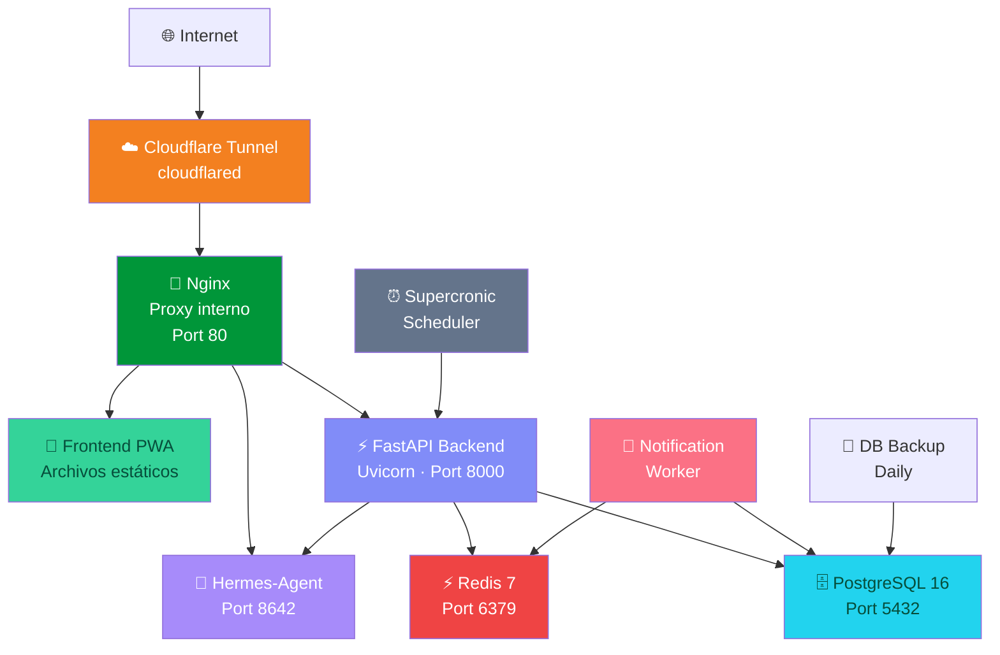

# 🩺 Azúcar Control — Plataforma Cloud de Gestión de Diabetes Tipo 2

Plataforma privada y de nivel premium diseñada para el control diario de la diabetes tipo 2. Permite a los usuarios monitorear sus niveles de glucosa, organizar hábitos saludables, controlar ayunos intermitentes, optimizar su estilo de vida y realizar análisis inteligentes de alimentos mediante Inteligencia Artificial (IA) con un asistente de salud virtual (Hermes-Agent).

---

## 📌 Estado Actual (Fase Actual: V1 Finalizada)
Actualmente, el repositorio cuenta con una aplicación funcional en el archivo raíz:
* **[index.html](file:///d:/azucar_app/index.html)**: Aplicación web interactiva completa (HTML/CSS/JS nativo) construida bajo un diseño oscuro premium con glassmorphism y micro-animaciones. 
  * **Sección de Emergencia**: Panel interactivo que cambia de color según el nivel de glucosa. Si el nivel supera los 250 mg/dL, se activa una alarma visual parpadeante y se despliegan recomendaciones médicas de crisis (hidratación, evitar ejercicio extremo, monitorear síntomas).
  * **Registro de Métricas**: Almacenamiento local (localStorage) de lecturas de glucosa, clasificándolas automáticamente y mostrando promedios históricos.
  * **Temporizador de Ayuno**: Contador de ayuno intermitente con protocolos configurables (16:8, 12:12, etc.) y selector visual.
  * **Alarmas y Recordatorios**: Configuración de alertas específicas para Metformina, hidratación o mediciones postprandiales.
  * **Registro de Hábitos**: Lista interactiva diaria para marcar ejercicio, agua, ayuno y medicación.

---

## 🚀 Plan de Transición: De Local a Cloud Full-Stack (Aprobado)
El objetivo es transformar la aplicación en una plataforma multi-tenant desplegada en un VPS utilizando contenedores Docker, accesible como PWA instalable en dispositivos móviles (Android/iOS) con persistencia Postgres y soporte de Inteligencia Artificial.

### 🌐 Arquitectura de Servicios Docker (9 Servicios)



### 📋 Presupuesto de Memoria (Para VPS de 3.8 GB)
* **Nginx + Frontend**: 64 MB (Archivos estáticos)
* **FastAPI Backend**: 384 MB (API principal + Uploads)
* **PostgreSQL 16**: 512 MB (shared_buffers ~256 MB)
* **Redis 7**: 128 MB (Colas e intermediario de tareas)
* **Cloudflared**: 64 MB (Túnel Cloudflare)
* **Notification Worker**: 128 MB (Procesador de Web Push)
* **Scheduler (Supercronic)**: 64 MB (Ejecución de Cron)
* **Hermes-Agent**: 384 MB (Cliente de OpenRouter, sin inferencia local)
* **DB Backup**: 64 MB (Respaldos programados)
* **TOTAL ESTIMADO**: **~1.8 GB** (dejando ~2.0 GB libres para el OS y swap adicional).

---

## 🖥️ Configuración del Servidor (VPS)

* **Host**: `ubuntu@10.40.2.156` (Nombre de host VPS: `azucar-app`)
* **Sistema Operativo**: Ubuntu Server (Kernel `6.8.0-90-generic`)
* **Especificaciones**: 2 vCPU, 3.8 GB de RAM total, 48 GB SSD.
* **Llave de Acceso SSH**: Guardada localmente en la carpeta no-comiteable: `d:\azucar_app\.ssh\vps_key`
* **Comando de Conexión**:
  ```powershell
  ssh -i "d:\azucar_app\.ssh\vps_key" -o StrictHostKeyChecking=no ubuntu@10.40.2.156
  ```

---

## 🛠️ Fases del Desarrollo Full-Stack

### 🔹 Fase 0: Preparación del VPS (Primer paso en ejecución)
1. Configurar una Swap de 4 GB para prevenir caídas por falta de memoria (Out-of-Memory).
2. Instalar el runtime de Docker y Docker Compose en la máquina remota:
   ```bash
   # Configurar Swap
   sudo fallocate -l 4G /swapfile
   sudo chmod 600 /swapfile
   sudo mkswap /swapfile
   sudo swapon /swapfile
   echo '/swapfile none swap sw 0 0' | sudo tee -a /etc/fstab

   # Instalar Docker
   curl -fsSL https://get.docker.com | sudo sh
   sudo usermod -aG docker ubuntu
   ```

### 🔹 Fase 1: Dockerización y Orquestación
1. Crear el archivo `docker-compose.yml` en la raíz del proyecto.
2. Definir los límites de memoria y reinicio para los 9 servicios.
3. Configurar el túnel de Cloudflare utilizando el token del usuario:
   * **Token CF**: `eyJhIjoiMjc1NWI0MWI4MTFkYzlhZmM3Mzk2ZWQ1ZDFlMjc2NDQiLCJ0IjoiNTBhYzk3MzktMTVhMS00MDVhLWIxMTMtMjFjYjc0YzNjYzllIiwicyI6Ill6QmxaREEyT0RNdE4yRTBaQzAwT1RFM0xUbG1Oemt0WVdOak5XVXpPV0k0T1RsaSJ9`
4. Crear la estructura de variables de entorno `.env.example`.

### 🔹 Fase 2: Backend API (FastAPI)
1. Estructurar el backend en Python con FastAPI.
2. Definir los modelos de datos en SQLAlchemy 2.0 (todos indexados por `user_id` para garantizar el aislamiento multi-tenant):
   * **User**: Credenciales hasheadas con bcrypt.
   * **GlucoseReading**: Lectura con tipo de condición (ayunas/postprandial).
   * **FastingSession**: Sesión de ayuno intermitente.
   * **HabitLog**: Checklist de hábitos diarios.
   * **Alarm**: Configuración de alarmas.
   * **MealEntry**: Ruta de foto + JSONB con resultados del análisis de IA.
   * **PushSubscription**: Datos de endpoint del navegador para Web Push.
3. Generar migraciones con Alembic.

### 🔹 Fase 3: Frontend PWA (Refactorización)
1. Mover `index.html` a la carpeta `/frontend` y adaptarlo para consumir los endpoints REST de la API.
2. Implementar almacenamiento seguro del token JWT en memoria.
3. Agregar el archivo de manifiesto (`manifest.json`) e iconos PWA para que sea instalable desde Safari/Chrome.
4. Desarrollar el Service Worker (`sw.js`) para soporte offline y recepción de notificaciones Push.

### 🔹 Fase 4: Notificaciones Web Push y Tareas en Segundo Plano
1. Implementar la API de notificaciones en el navegador sin dependencias de Google (Firebase).
2. Usar la librería `pywebpush` con llaves VAPID en el backend.
3. Configurar un worker que consuma tareas de Redis para despachar las notificaciones sin bloquear la API.
4. Programar recordatorios mediante tareas cron usando `Supercronic`.

### 🔹 Fase 5: Análisis de Comidas con Visión Artificial y Asistente Hermes
1. Habilitar la subida de imágenes de comida.
2. El Backend enviará la foto en base64 a OpenRouter utilizando la clave del usuario (ej. modelo Kimi 2.6 o GPT-4o).
3. **Flujo de imagen**:
   * Usuario sube foto -> IA analiza nutrientes (calorías, carbohidratos, grasas, proteínas, impacto glucémico) -> Pillow comprime la foto a un thumbnail ligero en el backend -> Se elimina la foto original para ahorrar almacenamiento en disco.
4. Ejecutar el contenedor de `Hermes-Agent` con memoria de salud persistente para interactuar directamente con el paciente en lenguaje natural.

### 🔹 Fase 6: Despliegue en Producción
1. Clonar el repositorio en el VPS.
2. Colocar el archivo `.env` configurado.
3. Levantar la pila completa con `docker compose up -d --build`.
4. Ejecutar migraciones e inicializar la base de datos Postgres.

---

## 📌 Comandos Útiles de Git en Windows
Para ejecutar comandos de Git en la consola de comandos de Windows (Powershell), es necesario refrescar las variables de entorno si acabas de instalar Git. Puedes correr esta línea al iniciar tu consola:

```powershell
$env:Path = [System.Environment]::GetEnvironmentVariable("Path","Machine") + ";" + [System.Environment]::GetEnvironmentVariable("Path","User")
```

Ejemplos de comandos comunes:
* **Estado**: `git status`
* **Subir cambios**:
  ```powershell
  git add .
  git commit -m "Descripción del cambio"
  git push origin main
  ```

---

## 💡 Instrucciones para el Próximo Agente o Desarrollador
1. **Revisar el archivo** `index.html` para entender la lógica del cliente y la estética visual de glassmorphism que el usuario desea preservar.
2. **Leer la configuración de conexión SSH** y el estado del VPS especificado arriba.
3. **Iniciar con la Fase 0 y Fase 1** del plan de implementación detallado en `implementation_plan.md` tras obtener confirmación del usuario para proceder.
4. **Respetar el idioma**: Toda la interfaz del usuario y los mensajes médicos deben permanecer en **Español**.
