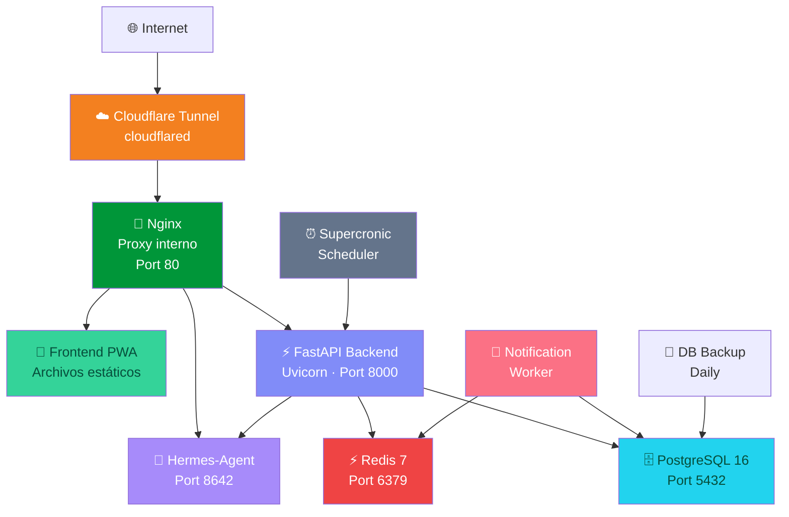

# 🩺 Azúcar Control — Plataforma Cloud de Gestión de Diabetes Tipo 2

Plataforma privada y de nivel premium diseñada para el control diario de la diabetes tipo 2. Permite a los usuarios monitorear sus niveles de glucosa, organizar hábitos saludables, controlar ayunos intermitentes, optimizar su estilo de vida y realizar análisis inteligentes de alimentos mediante Inteligencia Artificial (IA) con un asistente de salud virtual (Hermes-Agent).

La plataforma ha sido migrada con éxito de una aplicación cliente local basada en `localStorage` a una arquitectura full-stack moderna, multi-tenant y contenerizada en Docker, desplegada en un VPS y accesible como PWA móvil a través de un túnel seguro de Cloudflare.

---

## 📌 Estado del Proyecto: Despliegue Completado (V2 Cloud)

La plataforma está en producción y funcionando de manera saludable en el VPS. Todos los componentes y dependencias están completamente configurados.

### 🌐 Arquitectura de Servicios Docker (9 Servicios)



### 📋 Presupuesto de Memoria en VPS (3.8 GB de RAM)

El consumo real de la pila contenerizada ronda los **~1.8 GB**, lo cual es ideal para el VPS de 3.8 GB de RAM (dejando más de 2 GB libres para el sistema operativo y buffers del disco, apoyados por una **Swap de 4 GB** configurada en el host).

* **nginx (nginx:1.25-alpine)**: Servidor web y proxy inverso de alto rendimiento.
* **backend (FastAPI / Uvicorn)**: API REST principal, lógica de negocio y gestión de cargas.
* **worker (notification_worker)**: Worker asíncrono en Python que consume de Redis para enviar notificaciones Web Push.
* **scheduler (Supercronic)**: Ejecutor de crontab para automatizar alarmas periódicas y limpieza de almacenamiento.
* **db (PostgreSQL 16)**: Base de datos relacional para almacenamiento persistente y multi-usuario.
* **redis (Redis 7)**: Broker de mensajes para la cola de notificaciones y caché.
* **hermes (NousResearch/Hermes-Agent)**: Asistente virtual clínico conectado a la API de OpenRouter.
* **cloudflared**: Túnel de Cloudflare exponiendo de forma segura el puerto 80 hacia `azucar.aeisoftware.com` con SSL/TLS automático.
* **db-backup (postgres-backup-local)**: Copias de seguridad diarias de la base de datos PostgreSQL con retención de 7 días.

---

## 🖥️ Configuración del Servidor y Despliegue

* **Host**: `ubuntu@10.40.2.156` (VPS: `azucar-app`)
* **Acceso SSH (Windows/Powershell)**:
  ```powershell
  ssh -i "d:\azucar_app\.ssh\vps_key" -o StrictHostKeyChecking=no ubuntu@10.40.2.156
  ```

### Estructura de Directorios en el VPS

El proyecto está clonado en `~/azucar_app` con la siguiente estructura limpia:
```
azucar_app/
├── docker-compose.yml       # Orquestación de producción (9 servicios)
├── docker-compose.dev.yml   # Entorno de desarrollo local
├── .env                     # Variables de entorno (VAPID, DB, OpenRouter, CF Token)
├── frontend/                # Archivos de la PWA (index.html, sw.js, manifest.json)
│   └── uploads/             # Directorio de uploads en host (con .gitkeep)
├── backend/                 # API en Python FastAPI + worker de notificaciones
└── scheduler/               # Crontab + Tareas programadas (Supercronic)
```

---

## 🛠️ Comandos de Administración del Sistema

Todos los comandos de control se ejecutan dentro del directorio `~/azucar_app` en el VPS.

### Control de Contenedores

* **Ver estado**: `docker compose ps`
* **Iniciar todo**: `docker compose up -d`
* **Recompilar e Iniciar**: `docker compose up -d --build`
* **Detener todo**: `docker compose down`
* **Ver logs de un servicio**: `docker compose logs -f [nombre-servicio]` (ej. `docker compose logs -f backend`)

### Base de Datos y Migraciones

El esquema se gestiona a través de Alembic dentro del contenedor de backend.
* **Ejecutar migraciones pendientes**:
  ```bash
  docker compose exec backend alembic upgrade head
  ```
* **Crear nueva migración (tras modificar modelos)**:
  ```bash
  docker compose exec backend alembic revision --autogenerate -m "descripción"
  ```

---

## 🔒 Autenticación y Registro Multi-tenant

La plataforma no incluye credenciales de prueba preconfiguradas para proteger la privacidad. Cada usuario debe registrarse:
1. Abre `azucar.aeisoftware.com`.
2. En el panel de inicio, haz clic en **"Registrarse"**.
3. Ingresa tu correo y contraseña para crear una cuenta.
4. Las contraseñas se almacenan cifradas en PostgreSQL usando **Bcrypt** con hashing seguro de una sola vía.

---

## 💡 Notas de Soporte y Solución de Problemas

### 1. Error de Registro Resuelto (Bcrypt en Python 3.12)
* **Síntoma**: Al intentar registrar cuentas nuevas, el servidor FastAPI devolvía un código `500 Internal Server Error` debido a una excepción `ValueError: password cannot be longer than 72 bytes`.
* **Causa**: Las versiones modernas de la biblioteca `bcrypt` (5.0.0+) tienen problemas de compatibilidad de tipos con el wrapper `passlib[bcrypt]` usado en FastAPI bajo Python 3.12.
* **Solución**: Se fijó la dependencia `bcrypt==4.3.0` en `backend/requirements.txt`, lo cual resolvió de inmediato el error y permite el registro de usuarios de forma normal.

### 2. DNS y Túnel de Cloudflare
* **Apuntar el Túnel**: En el panel de Cloudflare Zero Trust, la configuración del Hostname Público para `azucar.aeisoftware.com` debe apuntar al puerto interno de Nginx en Docker:
  * **Type**: `HTTP`
  * **URL**: `nginx:80` (en lugar de `localhost:80`)
